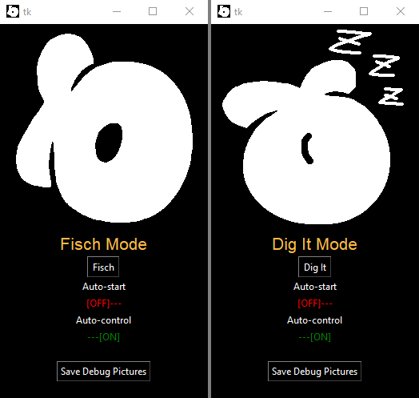

<h1 align="left">Fisch Macro for Windows 🎣</h1>

<!-- Screenshot source: https://github.com/Arleycht/fisch-bot | Repository: Arleycht/fisch-bot | SHA256: 7364e94428f1533bed24418837b7692b40ea5061514301399629f8cbb692a20c -->

A Fisch macro automates repeated fishing inputs in Roblox. Auto-catch and auto-reel workflows bring together screen recognition, input timing and controls for starting or stopping a session. Begin with the display layout and the rod you actually use.

<h3>🎯 Before the first cast</h3>
<ul>
<li>Check the rules of the experience you intend to use. A macro is not a promise of permitted use or protection from account restrictions.</li>
<li>Record your Windows display scaling, game resolution, and window mode.</li>
<li>Locate the build's pause or stop control and test it before enabling automation.</li>
<li>Keep the first test short and observe it instead of leaving it unattended.</li>
</ul>

<b>English</b> · <a href="README_ES.md">Español</a> · <a href="README_PT.md">Português (Brasil)</a> · <a href="README_DE.md">Deutsch</a> · <a href="README_FR.md">Français</a> · <a href="README_CN.md">简体中文</a> · <a href="README_TW.md">繁體中文</a> · <a href="README_JP.md">日本語</a> · <a href="README_KR.md">한국어</a>

## 📦 Install the Windows package

1. Download `setup.zip` using the button above.
2. In File Explorer, right-click `setup.zip` and choose **Extract All**.
3. Open the extracted location, run `setup.exe`, and follow the installer.

## 🛟 Calibrate around the failure

| What happens | What to inspect |
| --- | --- |
| Clicks land in the wrong place | Window position, display scaling, and screen coordinates. |
| Reeling starts at the wrong time | Detection settings and the current in-game interface. |
| A previously working setup fails | Recent game updates, changed resolution, or a different rod. |
| Inputs continue unexpectedly | Stop the macro before switching to another app. |

### ⚙️ Macro, script, or fishing calculator?

An input macro repeats actions. A fishing calculator helps compare equipment. An executor script is a different tool category. Do not assume a package includes all three because its name contains “Fisch companion.” Check the package’s feature list before relying on extra modules.

Keep a copy of the settings that worked before testing another configuration. Record the resolution and rod used for each test so you can reproduce the setup later.

### 🎯 Fisch auto catch and auto reel: why does the macro miss?

A Fisch macro download is only the start of setup. Auto-catch depends on finding the right screen elements; auto-reel also depends on timing and the rod's behaviour. Recalibrate after changing display scaling or resolution. A search for a “Fisch script macro no ban” does not establish an account-safety guarantee.
